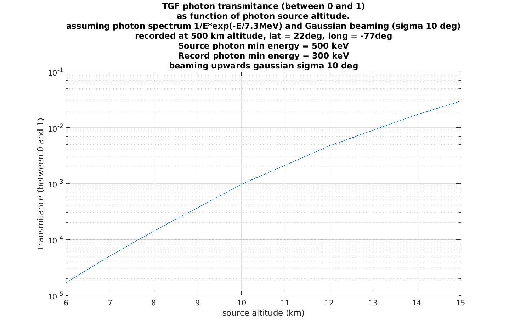

* GEANT4 project to evaluate the absorption (or transmitance) of TGF photons from source to satellite altitude

* Source photon energy spectrum: E^-1 * exp(-E/7.3MeV)

* upwards directed (vertical) with angular distribution Gaussian with sigma = 10 deg

* The TGF starts at several altitudes, and is recorded at 500 km altitude.

